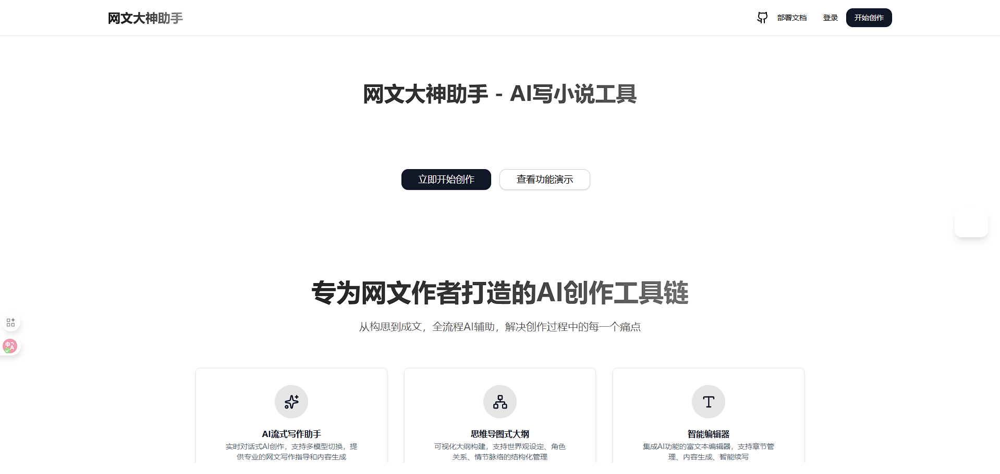
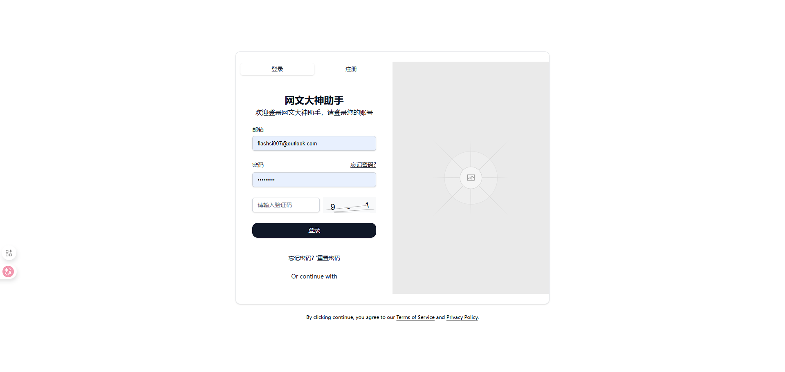
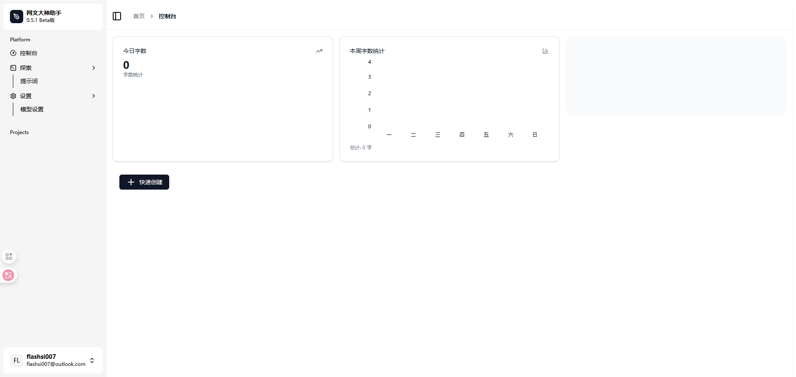
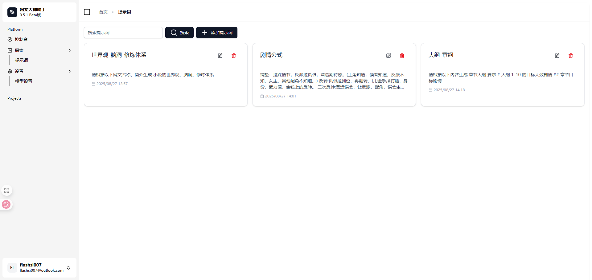
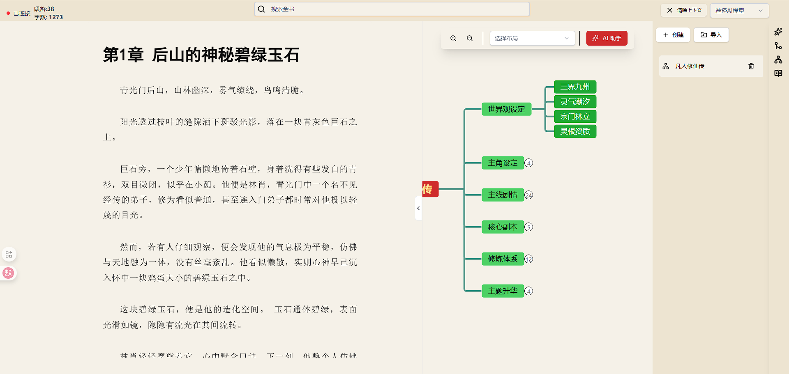

# 🖋️ 网文大神助手 (WangAI Studio)

> 基于AI的智能网文创作平台，让每个人都能成为网文大神

## ✨ 项目简介

网文大神助手是一个现代化的网络小说创作平台，集成了AI写作助手、可视化大纲管理、智能章节编辑等功能，旨在为网文作者提供最佳的创作体验。

## 在线预览
访问地址: https://www.wangai.studio

## 界面预览
 

 )

### 🎯 核心特色

- 🤖 **AI智能写作** - 基于大语言模型的智能续写和创意激发
- 🗺️ **可视化大纲** - 思维导图式的故事结构规划
- 📝 **专业编辑器** - 基于Tiptap的富文本编辑体验
- 👥 **角色管理** - 系统化的人物设定和关系管理
- 📚 **章节管理** - 智能的章节组织和版本控制
- 🎨 **现代界面** - 响应式设计，支持多主题切换
- ⚡ **实时协作** - 多设备同步，实时保存